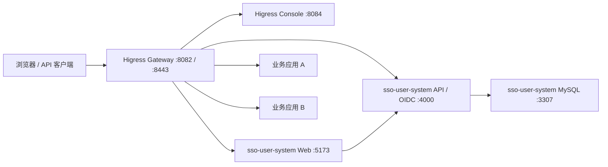
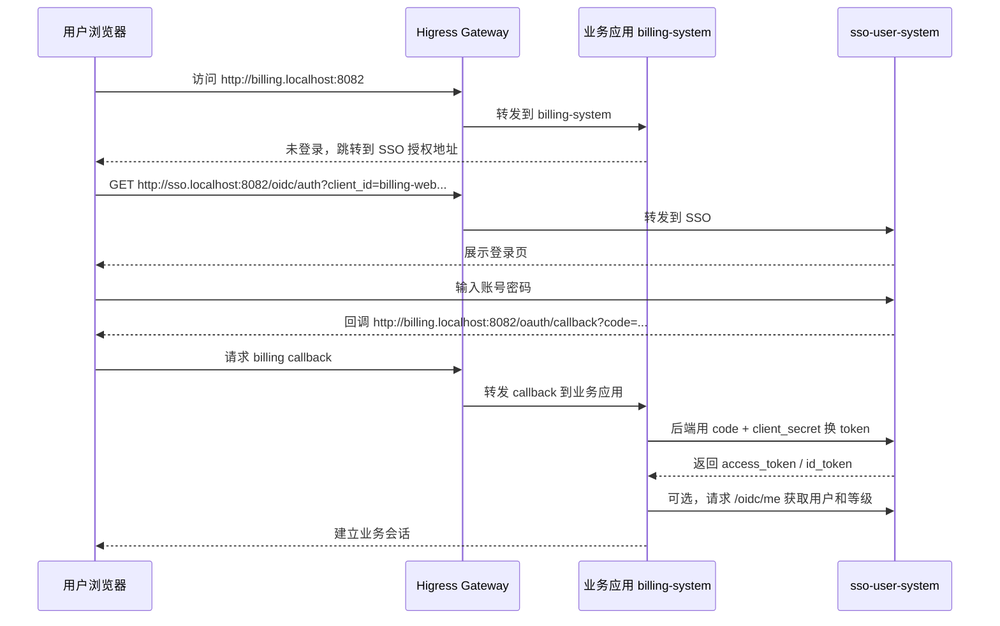

# Higress API 网关使用手册

本目录是项目集群的统一入口网关，用来替换之前的 Gravitee APIM。当前版本基于 Higress Standalone `v2.2.1`，通过 Docker Compose 在本机运行。

网关的职责是：

- 统一接收所有业务应用请求。
- 根据域名、路径、请求方法把请求转发到对应应用。
- 在进入业务应用前做认证、鉴权、限流、IP 限制、请求屏蔽等安全控制。
- 对接 `sso-user-system`，让业务应用统一使用用户中心登录和权限数据。
- 提供可视化控制台，后续大多数路由和插件都可以在界面里配置。

## 当前本地地址

| 服务 | 地址 | 说明 |
| --- | --- | --- |
| Higress Console | http://localhost:8084 | 网关管理界面 |
| Higress Gateway HTTP | http://localhost:8082 | 所有 HTTP 请求入口 |
| Higress Gateway HTTPS | https://localhost:8443 | 所有 HTTPS 请求入口 |
| Gateway Metrics | http://localhost:15020 | 网关健康和指标端口 |
| Nacos Console | http://localhost:8888 | Higress Standalone 配置存储 |

当前项目集群本地路由可以直接写入：

```bash
./scripts/configure-ai-image-routes.sh
```

该脚本按当前 Higress Standalone 控制台实际使用的 `Ingress + McpBridge` 方式配置：

| 域名 | 后端 |
| --- | --- |
| `sso.localhost` | `host.docker.internal:5173` |
| `sso-api.localhost` | `host.docker.internal:4000` |
| `image.localhost` | `host.docker.internal:3008` |

默认 Higress 管理员：

```text
username: admin
password: admin
```

## 常用命令

在项目根目录 `/Volumes/Macintosh HD 2/Develope/project-cluster` 执行：

```bash
./higress-api-gateway/scripts/dev-up.sh
./higress-api-gateway/scripts/status.sh
./higress-api-gateway/scripts/logs.sh
./higress-api-gateway/scripts/smoke-test.sh
./higress-api-gateway/scripts/dev-down.sh
```

说明：

- `dev-up.sh`：启动 Higress。
- `status.sh`：查看各组件状态。
- `logs.sh`：查看日志，可追加服务名，例如 `./higress-api-gateway/scripts/logs.sh gateway`。
- `smoke-test.sh`：检查 Console 和 Gateway 是否可访问。
- `dev-down.sh`：停止 Higress。

## 本地架构



本地开发时，Higress 运行在 Docker 容器内；如果要转发到 Mac 主机上运行的服务，不要在 Higress 里写 `localhost`，要写：

```text
host.docker.internal
```

例如：

- 主机上的 SSO API：`host.docker.internal:4000`
- 主机上的 SSO Web：`host.docker.internal:5173`
- 主机上的业务应用：`host.docker.internal:3000`

## 控制台的三个核心概念

Higress Console 里日常最常用的是这三步：

| 概念 | 菜单 | 作用 |
| --- | --- | --- |
| 服务来源 | `服务来源` | 告诉网关后端服务在哪里，例如域名 `host.docker.internal`、端口 `3000` |
| 域名 | `域名管理` | 告诉网关哪些 Host 归它管理，例如 `billing.localhost` |
| 路由 | `路由管理` | 告诉网关某个域名和路径应该转发到哪个服务 |

请求是否命中路由，主要由 `Host + Path + Method` 决定。

例如：

```bash
curl http://localhost:8082/ \
  -H 'Host: billing.localhost'
```

等价于浏览器访问：

```text
http://billing.localhost:8082/
```

如果没有匹配到你创建的域名和路由，网关会返回默认欢迎页或 404，而不是业务应用内容。

## 示例一：添加一个业务应用并通过网关访问

假设现在有一个新业务应用 `billing-system`，本机运行在：

```text
http://localhost:3000
```

目标是让用户通过网关访问：

```text
http://billing.localhost:8082
```

### 1. 确认应用本身可访问

先绕过网关直接访问后端：

```bash
curl -i http://localhost:3000/
```

如果这里都不通，先修业务应用，不要先改网关。

### 2. 创建服务来源

打开 Higress Console：

```text
http://localhost:8084
```

登录 `admin / admin`。

进入：

```text
服务来源 -> 创建服务来源
```

填写建议：

> 注意：如果后端地址是 `host.docker.internal`，服务来源类型必须选择 `DNS 域名 / DNS 服务（dns）`。不要选择 `固定地址 / static`，因为 fixed/static 只接受 `IP:端口`，不接受域名。

| 字段 | 示例值 |
| --- | --- |
| 名称 | `billing-service` |
| 类型 | `DNS 域名 / DNS 服务（dns）` |
| 域名 / 服务地址 | `host.docker.internal` |
| 端口 | `3000` |
| 协议 | `HTTP` |

端口要单独填写 `3000`，不要把服务地址写成 `host.docker.internal:3000`。

保存后，Higress 就知道 `billing-service` 这个后端服务在哪里。

### 3. 创建域名

进入：

```text
域名管理 -> 创建域名
```

填写：

| 字段 | 示例值 |
| --- | --- |
| 域名 | `billing.localhost` |
| 协议 | `HTTP` |

本地开发建议用 `*.localhost`，例如：

- `sso.localhost`
- `billing.localhost`
- `admin.localhost`

浏览器通常会把 `*.localhost` 解析到本机。如果你的环境不解析，可以用 `curl -H 'Host: billing.localhost' http://localhost:8082/` 验证，或手动写 `/etc/hosts`。

### 4. 创建路由

进入：

```text
路由管理 -> 创建路由
```

填写：

| 字段 | 示例值 |
| --- | --- |
| 路由名称 | `billing-route` |
| 关联域名 | `billing.localhost` |
| 匹配路径 | `/` |
| 匹配方式 | 前缀匹配 |
| 请求方法 | 不限制，或按需选择 `GET/POST/...` |
| 后端服务 | `billing-service` |
| 后端端口 | `3000` |

保存后，访问路径会是：

```text
用户 -> http://billing.localhost:8082/* -> Higress -> http://host.docker.internal:3000/*
```

### 5. 验证访问

浏览器访问：

```text
http://billing.localhost:8082/
```

或者命令行验证：

```bash
curl -i http://localhost:8082/ \
  -H 'Host: billing.localhost'
```

如果业务应用有 `/api/health`：

```bash
curl -i http://localhost:8082/api/health \
  -H 'Host: billing.localhost'
```

### 6. 常见路由问题

| 现象 | 常见原因 | 处理 |
| --- | --- | --- |
| 创建服务来源时报 `serviceSource body is not valid` | `host.docker.internal` 被按固定地址 static 提交了 | 服务来源类型改成 `DNS 域名 / DNS 服务（dns）`；static 只能填类似 `192.168.1.10:3000` 的 IP 地址 |
| 看到 Higress 欢迎页 | Host 没匹配到域名 | 检查域名、端口、`Host` 头 |
| 返回 404 | 路径没匹配到路由 | 检查路径匹配方式 |
| 返回 502/503 | 后端服务不可达 | 检查业务应用是否启动、端口是否正确、服务来源类型是否是 `DNS 域名 / DNS 服务（dns）` |
| 静态资源打不开 | 应用以子路径部署但资源仍用根路径 | 本地优先用独立域名，不要用 `/app1` 这种前缀 |
| 登录回调失败 | SSO Client 的 redirect URI 不一致 | 到 SSO 管理后台修改接入应用回调地址 |

## 示例二：把 sso-user-system 放到网关后面

`sso-user-system` 当前有两部分：

| 服务 | 本地地址 | 说明 |
| --- | --- | --- |
| Web | http://localhost:5173 | 登录页、管理后台 |
| API / OIDC | http://localhost:4000 | 用户接口、OIDC Provider |
| MySQL | localhost:3307 | 数据库，Docker 容器 |

本地启动方式：

```bash
cd /Volumes/Macintosh\ HD\ 2/Develope/project-cluster/sso-user-system
npm run db:up
npm run dev -w apps/api
npm run dev -w apps/web
```

建议开两个终端分别启动 API 和 Web，方便看日志。

启动后先绕过网关直连确认：

```bash
curl -i http://localhost:4000/health
curl -I http://localhost:5173/
```

只有这两个地址先通了，Higress 才能通过 `host.docker.internal:5173` 和 `host.docker.internal:4000` 转发到 SSO。

### 1. 创建 SSO 服务来源

本地开发最简单的方式，是让网关转发到 Vite Web 服务，由 Vite 再代理 `/auth`、`/login`、`/oidc` 到 API。

进入：

```text
服务来源 -> 创建服务来源
```

填写：

| 字段 | 示例值 |
| --- | --- |
| 名称 | `sso-web-dev` |
| 类型 | `DNS 域名 / DNS 服务（dns）` |
| 域名 / 服务地址 | `host.docker.internal` |
| 端口 | `5173` |
| 协议 | `HTTP` |

再创建一个直连 API 的服务来源，便于健康检查、OIDC 调试和后续外部鉴权：

| 字段 | 示例值 |
| --- | --- |
| 名称 | `sso-api` |
| 类型 | `DNS 域名 / DNS 服务（dns）` |
| 域名 / 服务地址 | `host.docker.internal` |
| 端口 | `4000` |
| 协议 | `HTTP` |

### 2. 创建 SSO 域名

进入：

```text
域名管理 -> 创建域名
```

填写：

| 字段 | 示例值 |
| --- | --- |
| 域名 | `sso.localhost` |
| 协议 | `HTTP` |

再创建一个 API 调试域名：

| 字段 | 示例值 |
| --- | --- |
| 域名 | `sso-api.localhost` |
| 协议 | `HTTP` |

### 3. 创建 SSO 路由

进入：

```text
路由管理 -> 创建路由
```

填写：

| 字段 | 示例值 |
| --- | --- |
| 路由名称 | `sso-web-route` |
| 关联域名 | `sso.localhost` |
| 匹配路径 | `/` |
| 匹配方式 | 前缀匹配 |
| 后端服务 | `sso-web-dev` |
| 后端端口 | `5173` |

注意：`sso-web-dev` 是服务来源名称，`sso-web-route` 是路由名称，两者不是同一个概念。如果你把服务来源也命名成了 `sso-web-route`，路由里的“后端服务”就必须选择 `sso-web-route`。

保存后访问：

```text
http://sso.localhost:8082/
```

再创建一条 API 调试路由：

| 字段 | 示例值 |
| --- | --- |
| 路由名称 | `sso-api-route` |
| 关联域名 | `sso-api.localhost` |
| 匹配路径 | `/` |
| 匹配方式 | 前缀匹配 |
| 后端服务 | `sso-api` |
| 后端端口 | `4000` |

命令行验证：

```bash
curl -i http://localhost:8082/ \
  -H 'Host: sso.localhost'

curl -i http://localhost:8082/health \
  -H 'Host: sso-api.localhost'

curl -i http://localhost:8082/oidc/.well-known/openid-configuration \
  -H 'Host: sso.localhost'
```

如果 `sso-api.localhost/health` 返回 `{"status":"ok"}`，说明网关到 SSO API 的链路通了。如果 `sso.localhost/oidc/.well-known/openid-configuration` 返回 OIDC 配置，说明通过 SSO Web 入口代理 OIDC 也通了。

如果访问 `http://sso.localhost:8082/` 返回 `503 Service Unavailable` 且错误里有 `Connection refused`，通常表示路由已经命中，但 SSO Web/API 没启动，或者服务来源端口填错。先确认 `localhost:5173` 和 `localhost:4000/health` 能直连访问，再检查路由后端服务是否选中了正确的服务来源。

### 4. 调整 SSO 外部 Issuer

如果后续希望所有业务应用都通过网关访问 SSO，`sso-user-system/.env` 里的 Issuer 也要改成网关地址：

```env
OIDC_ISSUER=http://sso.localhost:8082/oidc
WEB_ORIGIN=http://sso.localhost:8082
```

改完后重启 `apps/api`。

注意：已经写入数据库的 OAuth Client 回调地址不会因为 `.env` 自动改掉。业务应用接入时，请在 SSO 管理后台的「接入应用」里创建或修改对应 Client。

## 示例三：业务应用接入 SSO 登录

假设业务应用仍然是：

```text
http://billing.localhost:8082
```

### 1. 在 SSO 创建接入应用

打开 SSO 管理后台：

```text
http://sso.localhost:8082/
```

使用 SSO 默认管理员登录：

```text
username: admin
password: Admin123456!
```

进入：

```text
接入应用 -> 新增应用
```

填写：

| 字段 | 示例值 |
| --- | --- |
| 应用名称 | `Billing System` |
| Client ID | `billing-web` |
| Redirect URI | `http://billing.localhost:8082/oauth/callback` |
| Scopes | `openid profile email` |
| 应用等级 | 例如 `free,pro,enterprise` |

保存后复制 `client_secret`。这个密钥只能放在业务应用后端，不要写进浏览器前端。

### 2. 给用户等级授权应用访问

进入：

```text
等级与权限
```

找到需要允许访问 `Billing System` 的等级，例如：

- `free`
- `plus`
- `pro`
- `ultra`

开启该等级对 `billing-web` 的访问，并选择应用内等级。

如果某个用户所属等级没有访问这个 Client，SSO 登录时会拒绝授权。

### 3. 业务应用配置 OIDC 参数

业务应用后端保存：

```env
SSO_ISSUER=http://sso.localhost:8082/oidc
SSO_CLIENT_ID=billing-web
SSO_CLIENT_SECRET=<从 SSO 管理后台复制>
SSO_REDIRECT_URI=http://billing.localhost:8082/oauth/callback
```

### 4. 登录流程



### 5. 授权地址示例

业务应用发起登录时，跳转用户浏览器到：

```text
http://sso.localhost:8082/oidc/auth
  ?client_id=billing-web
  &redirect_uri=http%3A%2F%2Fbilling.localhost%3A8082%2Foauth%2Fcallback
  &response_type=code
  &scope=openid%20profile%20email
  &state=<随机值>
  &code_challenge=<PKCE挑战值>
  &code_challenge_method=S256
```

回调到业务应用后，业务应用后端换 token：

```bash
curl -X POST http://sso.localhost:8082/oidc/token \
  -H 'content-type: application/x-www-form-urlencoded' \
  --data-urlencode 'grant_type=authorization_code' \
  --data-urlencode 'client_id=billing-web' \
  --data-urlencode 'client_secret=<client-secret>' \
  --data-urlencode 'code=<authorization-code>' \
  --data-urlencode 'redirect_uri=http://billing.localhost:8082/oauth/callback' \
  --data-urlencode 'code_verifier=<pkce-code-verifier>'
```

获取用户信息：

```bash
curl http://sso.localhost:8082/oidc/me \
  -H 'authorization: Bearer <access-token>'
```

`/oidc/me` 会返回用户 ID、状态、用户等级、应用内等级和额度信息。业务应用应使用 `sub` 作为本地用户映射主键。

## 示例四：让网关先做统一登录校验

上面的方式是“业务应用自己处理 OIDC 登录”。如果你希望“用户请求先到网关，由网关确认登录后再放行”，可以在 Higress 路由上启用 OIDC 插件。

适用场景：

- 页面型应用，希望未登录用户自动跳转到 SSO。
- 后端应用暂时没有自己的登录拦截。
- 想把基础登录态统一放到网关层处理。

### 1. 在 SSO 创建网关专用 Client

进入 SSO：

```text
接入应用 -> 新增应用
```

填写：

| 字段 | 示例值 |
| --- | --- |
| 应用名称 | `Billing Gateway Auth` |
| Client ID | `billing-gateway` |
| Redirect URI | `http://billing.localhost:8082/oauth2/callback` |
| Scopes | `openid profile email` |

保存后复制 `client_secret`。

### 2. 在 Higress 路由上启用 OIDC 插件

进入：

```text
路由管理 -> billing-route -> 策略 / 插件 -> OIDC 认证
```

配置示例：

```yaml
redirect_url: http://billing.localhost:8082/oauth2/callback
oidc_issuer_url: http://sso.localhost:8082/oidc
client_id: billing-gateway
client_secret: <从 SSO 复制的 client_secret>
scope: openid profile email
cookie_secret: <生成一个高强度随机值>
```

保存后，访问：

```text
http://billing.localhost:8082/
```

预期流程：

1. 未登录用户访问业务应用。
2. Higress OIDC 插件发现没有登录 Cookie。
3. Higress 跳转到 `sso-user-system` 登录。
4. 登录成功后回到 `http://billing.localhost:8082/oauth2/callback`。
5. Higress 写入登录 Cookie。
6. Higress 再把请求转发到业务应用。

注意：

- `OIDC_ISSUER` 必须与 `oidc_issuer_url` 对外地址一致。
- SSO Client 的 Redirect URI 必须与 `redirect_url` 完全一致。
- 生产环境必须使用 HTTPS，并把 Cookie 设置成安全模式。
- 网关做了登录校验，不代表业务应用可以完全不鉴权。涉及具体资源权限时，业务应用仍应校验用户身份、等级和资源归属。

## 示例五：API 请求用 JWT 认证

如果是移动端、后端服务、CLI 这类 API 调用，通常不会走浏览器跳转登录。推荐流程是：

1. 客户端先向 SSO 登录并拿到 `access_token`。
2. 请求业务 API 时带上：

```http
Authorization: Bearer <access-token>
```

3. Higress 在路由上启用 `JWT 认证` 插件。
4. 网关验证 token 签名、issuer、过期时间和 consumer 访问权限。
5. 验证通过后再转发到业务应用。

### 1. 获取 SSO JWKS

```bash
curl http://sso.localhost:8082/oidc/jwks
```

生产环境必须配置稳定的 JWKS。当前 `sso-user-system` MVP 使用开发签名密钥，重启后可能变化，不能直接当生产方案。

### 2. 配置 JWT 插件

进入：

```text
插件市场 -> JWT 认证
```

全局配置示例：

```yaml
global_auth: false
consumers:
  - name: billing-web
    issuer: http://sso.localhost:8082/oidc
    jwks: |
      {
        "keys": []
      }
    from_headers:
      - name: Authorization
        value_prefix: "Bearer "
    claims_to_headers:
      - claim: sub
        header: x-sso-user-id
        override: true
      - claim: level_code
        header: x-sso-level-code
        override: true
```

把 `jwks.keys` 替换成 `/oidc/jwks` 返回的内容。

### 3. 在路由上允许指定 Consumer

进入：

```text
路由管理 -> billing-route -> 策略 / 插件 -> JWT 认证
```

配置：

```yaml
allow:
  - billing-web
```

验证：

```bash
curl -i http://localhost:8082/api/profile \
  -H 'Host: billing.localhost'

curl -i http://localhost:8082/api/profile \
  -H 'Host: billing.localhost' \
  -H 'Authorization: Bearer <access-token>'
```

预期：

- 不带 token：`401`
- token 无权限：`403`
- token 正确且允许访问：转发到业务应用

## 示例六：用外部鉴权接入更细的权限判断

OIDC/JWT 只能解决“你是谁”和“token 是否有效”。如果需要判断：

- 用户是否能访问某个应用。
- 用户等级是否能调用某个接口。
- 用户额度是否足够。
- 用户是否被锁定。
- 某个资源是否属于该用户。

推荐后续给 `sso-user-system` 增加一个网关鉴权接口，例如：

```text
POST /gateway/authz/check
```

Higress 使用 `ext-auth` 插件调用它。

### 1. 创建鉴权服务来源

如果鉴权接口在 `sso-user-system API` 上：

| 字段 | 示例值 |
| --- | --- |
| 名称 | `sso-authz` |
| 类型 | `DNS 域名 / DNS 服务（dns）` |
| 域名 / 服务地址 | `host.docker.internal` |
| 端口 | `4000` |

### 2. 在路由上启用外部认证

进入：

```text
路由管理 -> billing-route -> 策略 / 插件 -> 外部认证
```

配置示例：

```yaml
http_service:
  endpoint_mode: forward_auth
  endpoint:
    service_name: sso-authz.dns
    service_port: 4000
    path: /gateway/authz/check
    request_method: POST
  timeout: 1000
  authorization_request:
    allowed_headers:
      - exact: authorization
      - exact: cookie
      - exact: x-request-id
  authorization_response:
    allowed_upstream_headers:
      - exact: x-sso-user-id
      - exact: x-sso-level-code
      - exact: x-sso-app-level-code
status_on_error: 403
failure_mode_allow: false
```

预期行为：

- 鉴权接口返回 `200`：网关放行，并把允许的用户头传给业务应用。
- 鉴权接口返回 `401`：用户未登录。
- 鉴权接口返回 `403`：用户无权限。
- 鉴权接口超时或异常：网关拒绝，避免鉴权服务故障时误放行。

当前 `sso-user-system` 还没有专门的 `/gateway/authz/check`，这是后续最值得补的一步。补上后，网关就能真正做到“所有应用请求先到网关校验权限再分配路由”。

## 常用安全能力和操作步骤

插件有三种配置入口：

| 入口 | 菜单 | 生效范围 |
| --- | --- | --- |
| 全局 | `插件市场 -> 选择插件` | 没有被更细规则覆盖的请求 |
| 域名级 | `域名管理 -> 选择域名 -> 策略` | 当前域名 |
| 路由级 | `路由管理 -> 选择路由 -> 策略` | 当前路由，优先级最高 |

优先级：

```text
路由级 > 域名级 > 全局
```

### 1. 限流

用途：

- 防止暴力刷新。
- 限制接口 QPS。
- 防止单个 IP 或单个用户拖垮后端。

操作：

```text
路由管理 -> 选择路由 -> 策略 / 插件 -> 基于 Key 集群限流
```

示例：按 `x-forwarded-for` 对每个 IP 限制访问次数：

```yaml
rule_name: billing-ip-limit
rule_items:
  - limit_by_per_ip: from-header-x-forwarded-for
    limit_keys:
      - key: 0.0.0.0/0
        query_per_minute: 120
```

建议：

- 登录、注册、发验证码接口限得更严。
- 查询类接口适中。
- 管理后台接口只允许内网或管理员 IP。

### 2. IP 黑白名单

用途：

- 管理后台只允许固定 IP。
- 临时封禁异常来源。
- 对内接口只允许内网访问。

操作：

```text
路由管理 -> 选择路由 -> 策略 / 插件 -> IP 限制
```

示例：

```yaml
allow:
  - 127.0.0.1
  - 192.168.0.0/16
```

或者：

```yaml
deny:
  - 10.10.10.10
```

### 3. 请求屏蔽

用途：

- 屏蔽扫描器常见路径。
- 禁止访问调试接口。
- 屏蔽带危险参数或危险 Header 的请求。

操作：

```text
插件市场 / 路由策略 -> 请求屏蔽
```

建议屏蔽：

```yaml
block_urls:
  - /.env
  - /actuator
  - /swagger-ui
  - /debug
  - /phpmyadmin
case_sensitive: false
```

### 4. CORS

用途：

- 控制哪些前端域名可以跨域调用 API。

操作：

```text
路由管理 -> 选择 API 路由 -> 策略 / 插件 -> CORS
```

建议：

- 不要生产使用 `*`。
- 明确写允许的业务域名，例如 `https://billing.example.com`。
- 只开放必要的 Header 和 Method。

### 5. HTTPS / TLS

用途：

- 生产环境必须开启。
- OIDC 登录、Cookie、token 传输都必须走 HTTPS。

操作：

```text
域名管理 -> 选择域名 -> 配置证书
```

本地可以先用 HTTP；生产必须：

- 域名使用真实证书。
- SSO Issuer 使用 `https://.../oidc`。
- SSO Cookie 设置 Secure。
- 禁止把 `client_secret` 暴露到浏览器。

### 6. 请求头传递和改写

用途：

- 把网关识别出的用户信息传给后端。
- 移除不可信的客户端伪造头。
- 增加链路追踪 ID。

建议：

- 后端只信任网关注入的 `x-sso-user-id`、`x-sso-level-code` 等头。
- 网关应覆盖客户端传入的同名头，避免伪造身份。
- 所有业务应用记录 `x-request-id`，方便排障。

### 7. 日志和排障

查看容器状态：

```bash
./higress-api-gateway/scripts/status.sh
```

查看网关日志：

```bash
./higress-api-gateway/scripts/logs.sh gateway
```

查看控制台日志：

```bash
./higress-api-gateway/scripts/logs.sh console
```

验证网关：

```bash
./higress-api-gateway/scripts/smoke-test.sh
```

## 推荐的接入规范

### 域名命名

本地开发：

```text
sso.localhost
billing.localhost
admin.localhost
app-name.localhost
```

生产环境：

```text
sso.example.com
billing.example.com
admin.example.com
api.example.com
```

### 路由命名

```text
<应用名>-route
<应用名>-api-route
<应用名>-admin-route
```

示例：

```text
billing-route
billing-api-route
billing-admin-route
```

### 服务来源命名

```text
<应用名>-service
<应用名>-api
<应用名>-web
```

示例：

```text
billing-service
sso-web-dev
sso-api
```

### 安全默认值

新应用接入时建议至少配置：

1. 域名和路由。
2. 健康检查或 smoke test。
3. 登录态：业务应用 OIDC 或 Higress OIDC 插件二选一。
4. API：JWT 认证或外部鉴权。
5. 限流：登录和写接口优先。
6. IP 限制：管理后台优先。
7. 请求屏蔽：屏蔽常见扫描路径。
8. HTTPS：生产必须。

## 本机兼容说明

当前项目路径包含空格，官方 `bin/configure.sh` 有一处未加引号的重定向，已在本地修复。

本机 Docker Desktop 缺少 `docker-credential-desktop`，所以 `scripts/docker-env.sh` 会使用 `.docker-tmp` 作为干净的 `DOCKER_CONFIG`，避免拉镜像和 Compose 操作被全局 Docker 配置卡住。

macOS Docker Desktop 对绑定到宿主机共享目录的 Unix Socket 支持不稳定，Higress Gateway 的 `/var/run/secrets` 和 `/etc/istio/proxy` 已改为容器内 `tmpfs`，避免 gateway 启动时报 `operation not supported`。

`compose/.env` 包含本地生成的加密密钥，只保留在本机，不提交。

## 参考文档

- Higress 快速开始：https://higress.io/docs/latest/user/quickstart/
- Higress 插件使用引导：https://higress.io/docs/latest/plugins/intro/
- Higress OIDC 认证：https://higress.io/docs/latest/plugins/authentication/oidc/
- Higress JWT 认证：https://higress.io/docs/latest/plugins/authentication/jwt-auth/
- Higress 外部认证：https://higress.io/docs/latest/plugins/authentication/ext-auth/
- Higress IP 限制：https://higress.cn/docs/latest/plugins/traffic/ip-restriction/
- Higress 基于 Key 集群限流：https://higress.io/docs/latest/plugins/traffic/cluster-key-rate-limit/
- SSO 接入指南：`../sso-user-system/docs/integration/oauth-client-guide.md`
